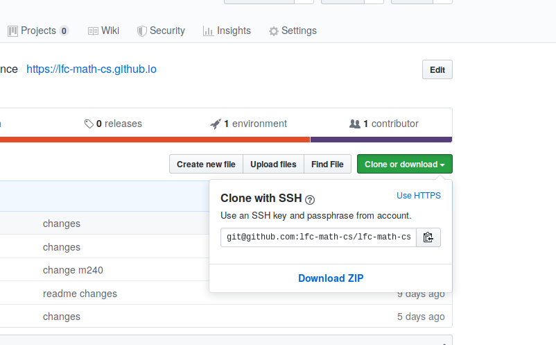

# GitHub's guide for <a href="index.html">M240</a>

## 1. Create a GitHub account
1. Install Git, in order to do that follow this <a href="https://git-scm.com/book/en/v2/Getting-Started-Installing-Git">guide</a>.
2. Go to <a href="https://github.com">GitHub</a> and creat an account.

## 2. Clone your repository

<ol>
<li>
You will receive an email from me with the link to your repository for each assignment. 
It will look like this <b>https://classroom.github.com/c/Xkoasd</b>.  
</li>
<li>Now to clone your repository, connect to Github, select the repository you want to clone and copy the address that appear when you click <b>Clone or download</b>
  

  
</li>
<li>Once you have copied this address, open a terminal, move into the folder of your choice 
( for example <code class="language-bash">cd ~/Documents</code> ) and type

<pre class="command-line"><code class="language-bash">git clone the-address-you-copied</code></pre>
</li>
<li> Now you can start coding!
</li>
</ol> 

## 3. Commit changes
On GitHub, saved changes are called commits. Each commit has an associated commit message, which is a description explaining why a particular change was made. 
Commit messages capture the history of your changes.
Once you are done making your changes you need to do the commit them to Github using the following commands:
<pre class="command-line"><code class="language-bash">git add each-file-you-modified
git commit -m "Explain what your changed"
git push</code></pre>